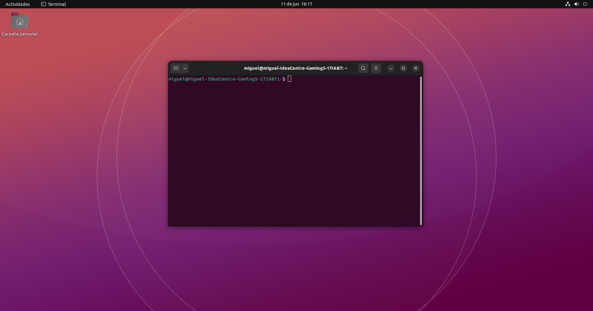

# La interfaz de línea de comandos

Si eres nuevo en este mundo de la programación, la linea de comandos te recordará a lo que sale en las películas cuando un hacker tiene que robar datos de algun lugar. Tranqui, no vamos a hackear a nadie ni nadie te va a hackear. Simplemente vamos darle instrucciones al ordenador de una forma distinta a la que sueles usar.

Aunque se parezcan, las lineas de comandos de los distintos sistemas operativos son diferentes. Dirígete a la opción que más te convenga según tu sistema operativo: [Windows](#windows), [Ubuntu/Linux](#ubuntulinux), [MacOS](#macos)

## Windows

Windows cuenta con dos terminales instaladas: cmd y PowerShell. Dado que es probable que utilices una versión de windows moderna, yo te recomiendo usar PowerShell. En cualquier caso, los comandos que utilizaremos serán prácticamente los mismos tanto para cmd como PowerShell.

### Abrir la línea de comandos

Para abrir una linea de comandos en Windows basta con presionar la tecla Windows en el teclado o hacer click en Inicio en la barra de tareas y, una vez allí, escribir `cmd`o `powershell` segun cual quieras abrir. Te aparecerá un icono. Haz click derecho sobre el icono y selecciona la opción "Ejecutar como administrador". Te preguntará si quieres ejecutar el programa como administrador y debes seleccionar sí. Esto sirve para poder otorgarle una serie de permisos a la línea de comandos que no serán necesarios para realizar las instalaciones necesarias.

Si has seleccionado PowerShell, deberías ver algo así:

TODO: Poner imagen de PowerShell.

## Ubuntu/Linux

¿Usas Ubuntu o alguna otra distribución de Linux y todavía no has usado la terminal?

### Abrir la línea de comandos

Bueno, por si acaso te explico rápidamente como hacerlo. En Ubuntu (y la mayoría de distribuciones) puedes utilizar el buscador de aplicaciones para escribir `Terminal`. Selecciona la aplicación que te aparece y deberías ver la terminal abierta. Lo que verás será similar a esto:



## MacOS

Aunque se pueden instalar terminales externas como [iTerm2](https://iterm2.com/), mantengamos las cosas simples y usemos la terminal que viene integrada con en Mac.

### Abrir la línea de comandos

Para abrir una linea de comandos en MacOS debes ir a Aplicaciones. Allí seleccionar Utilidades y finalmente puedes abrir la aplicación Terminal. Como alternativa, puedes presionar la tecla comando `⌘` y buscar `Terminal`.

> **Success** ¡Enhorabuena! Acabas de acceder a la línea de comandos.

## Distintas terminales, comandos similares.

Vamos a introducir nuestro primer comando en la línea de comandos. ¡Que emoción! En la ventana que tienes abierta escribe `whoami` y presiona la tecla `Enter`.

En Windows verás un mensaje como este:

Windows command-line

```bash
C:\Users\Miguel> whoami
Miguel
```

TODO: Check que esto sea así.

En Ubuntu/Linux verás lo siguiente:

Ubuntu/Linux command-line

```bash
miguel@miguel: ~$ whoami
Miguel
```

Por último, en MacOS verás algo así:

MacOS command-line

```bash
miguel@miguel: ~ % whoami
Miguel
```

Como ves, el mismo comando sirve en las tres pero las tres tienen pequeñas diferencias. De aquí en adelante, cuando hablemos de comandos en la terminal simplemente escribiré el cmando y el resultado con el siguiente formato:

Windows command-line

```bash
> whoami # Comando
Miguel # Resultado
```

En otros lugares, especialmente si estás enfocado a Linux o MacOS verás que utilizan formatos como:

Ubuntu/Linux and MacOS command-line

```bash
$ whoami # Comando
Miguel # Resultado
```

o quizá

Ubuntu/Linux and MacOS command-line

```bash
% whoami # Comando
Miguel # Resultado
```

Al referirme en especifico a terminales de Ubuntu/Linux y MacOS usaré siempre el símbolo `$`

## Otros comandos simples.

El comando que hemos utilizado antes (`whoami`) devuelve el usuario con el que se ha iniciado sesión en el ordenador. Otros comandos pueden indicarnos en qué carpeta nos encontramos. Para ello utiliza el comando `pwd`

Windows command-line

```bash
> pwd
C:\Users\miguel
```

En Ubuntu y Mac será una cosa similar a:

Ubuntu/Linux and MacOS command-line

```bash
$ pwd
/Users/miguel
```

Otros comandos nos permiten movernos entre carpetas usando la terminal. Si utilizas el comando `cd ..` irás a la carpeta inmediatamente superior. Si utilizas de nuevo `pwd` comprobarás que te has movido de carpeta.

Windows:

Windows command-line

```bash
> cd ..
> pwd
C:\Users
```

Ubuntu y MacOS:

Ubuntu/Linux and MacOS  command-line

```bash
$ cd ..
$ pwd
/Users
```

¿Cómo podemos saber los archivos o carpetas que tenemos disponibles en la carpeta en la que estamos? En Windows podemos usar el comando `dir`, mientras que si estamos en Ubuntu/Linux o MacOS podemos utilizar el comando ls:

Windows command-line

```bash
> dir

Directory of C:\Users\miguel
11/06/2023 18:47:28 <DIR> Applications
11/06/2023 18:47:28 <DIR> Desktop
11/06/2023 18:47:28 <DIR> Downloads
11/06/2023 18:47:28 <DIR> Music
11/06/2023 18:47:28 <DIR> Users

```

Ubuntu/Linux and MacOS  command-line

```bash
$ ls
Applications
Desktop
Downloads
Music
Users
```

Si quisiéramos volver a nuestra carpeta `Users` tendríamos que usar el comando `cd` seguido de la carpeta a la que queremos volver:

Windows command-line

```bash
> cd Users
> pwd
C:\Users\miguel
```

Ubuntu/Linux and MacOS command-line

```bash
$ cd Users
$ pwd
/Users/miguel
```

Otros comandos nos permiten ejecutar programas o realizar acciones. Por ejemplo, el comando `mdkir <nombre-de-la-carpeta>` permite crear carpetas nuevas. Por ejemplo, si quisieramos crear una carpeta llamada "tutorial_manim" deberíamos usar el comando siguiente:

Windows command-line

```bash
> mkdir tutorial_manim
> cd tutorial_manim
> pwd
C:\Users\miguel\tutorial_manim
```

Ubuntu/Linux and MacOS command-line

```bash
$ mkdir tutorial_manim
$ cd tutorial_manim
$ pwd
/Users/miguel/tutorial_manim
```


> **Comment** Comentario: Abajo te dejo una lista de comandos de uso habitual que he sacado directamente del [tutorial de las django girls](https://tutorial.djangogirls.org/es/intro_to_command_line/). 


| Comando (Windows) | Comando (Mac OS / Linux) | Descripción                 | Ejemplo                                                 |
| ----------------- | ------------------------ | ---------------------------- | ------------------------------------------------------- |
| exit              | exit                     | Cierra la ventana            | **exit**                                          |
| cd                | cd                       | Cambia el directorio         | **cd test**                                       |
| cd                | pwd                      | Mostrar el directorio actual | **cd** (Windows) o **pwd** (Mac OS / Linux) |
| dir               | ls                       | Lista directorios/archivos   | **dir**                                           |
| copy              | cp                       | Copia de archivos            | **copy c:\test\test.txt c:\windows\test.txt**     |
| move              | mv                       | Mueve archivos               | **move c:\test\test.txt c:\windows\test.txt**     |
| mkdir             | mkdir                    | Crea un nuevo directorio     | **mkdir testdirectory**                           |
| rmdir (o del)     | rm                       | Eliminar un archivo          | **del c:\test\test.txt**                          |
| rmdir /S          | rm -r                    | Eliminar un Directorio       | **rm -r testdirectory**                           |
